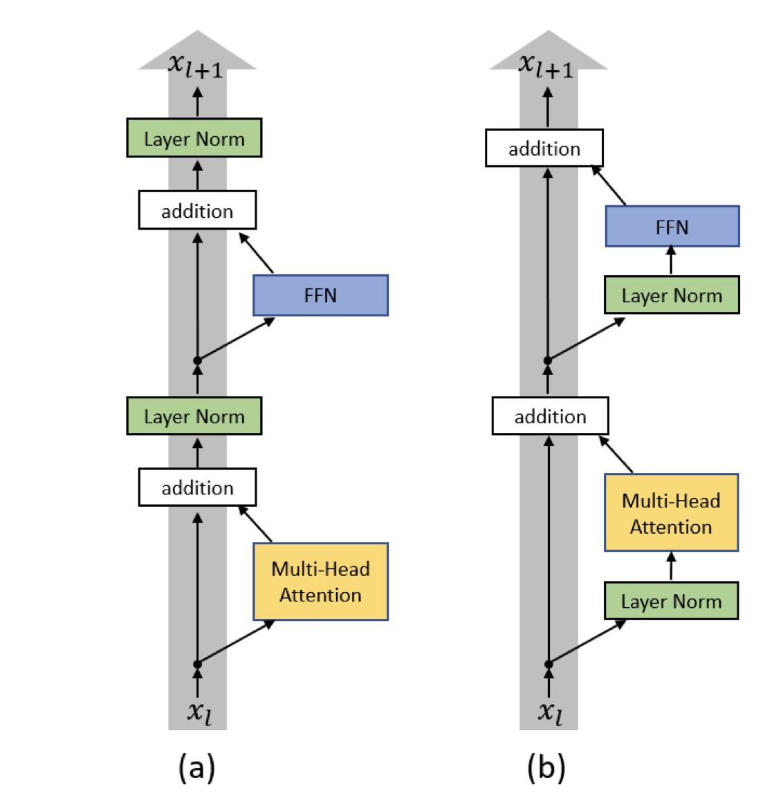
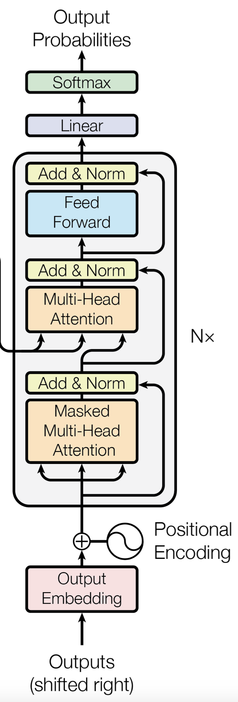
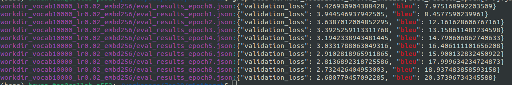

# Assignment 3: Transformer Architecture

We will continue adding modules to miniTorch framework.
In this assignment, students will implement a decoder-only transformer architecture (GPT-2), train it on machine translation task (IWSLT14 German-English), and benchmark their implementation.

**Note: You may need to spend at least 10 hours for the training process for Problem 4. Make sure you have enough time to complete the assignment.**

## Homework Setup

The starting code base is provided in [llmsys\_hw3](https://github.com/llmsystem/llmsys_hw3).

## Setting up Your Code

### Step 1: Install Requirements

Ensure you have Python 3.12+ installed. Install the required dependencies with the following commands:

Run the following command:

```
git clone https://github.com/llmsystem/llmsys_hw3.git
cd llmsys_hw3

# load the CUDA module
module load cuda/12.4.0

# create a virtual environment and activate it
uv venv --python=3.12
source .venv/bin/activate

# install the requirements
uv pip install -r requirements.extra.txt
uv pip install -r requirements.txt

# install miniTorch in editable mode
uv pip install -e .
```

### Step 2: Copy Files from Assignment 1 & 2

Copy the following files to the specified locations:

- `llmsys_hw2/minitorch/autodiff.py` → `minitorch/autodiff.py`
- `llmsys_hw2/project/run_sentiment.py` → `project/run_sentiment_linear.py`

**Note**: The suffix for the sentiment file is slightly different: `"_linear"`.

### Step 3: Copy Functions from Assignment 1

Extract and transfer `only` the implementations of the following functions from `llmsys_hw1/src/combine.cu` to `src/combine.cu`:

- `MatrixMultiplyKernel`
- `mapKernel`
- `zipKernel`
- `reduceKernel`

**Reasons for the copy:**
We have made some changes in `combine.cu` and `cuda_kernel_ops.py` for Assignment 3 compared with Assignment 2 :

- GPU memory allocation, deallocation, and memory copying operations have been relocated from `cuda_kernel_ops.py` to `combine.cu`, covering both host-to-device and device-to-host transfers.
- The datatype for `Tensor._tensor._storage` has been changed from `numpy.float64` to `numpy.float32`.

### Step 5: Compile CUDA Kernels

Compile your CUDA kernels by running:

```
bash compile_cuda.sh
```

---

## Implementing a Decoder-only Transformer Model

You will be implementing a Decoder-only Transformer model in `minitorch/transformer.py.py`. This will require you to first implement additional modules in `minitorch/modules_basic.py`, similar to the Linear module from Assignment 2.

We will recreate the GPT-2 architecture as described in [Language Models are Unsupervised Multitask Learners](https://paperswithcode.com/paper/language-models-are-unsupervised-multitask).

**Please read the following implementation details section before starting.**

## Problem 1: Implementing Tensor Functions (20 pts)

You need to implement the following functions in `minitorch/nn.py` (highlighted with `BEGIN ASSIGN3_1` and `END ASSIGN3_1`)

- **`logsumexp`**
- **`softmax_loss`**

The formula for the softmax loss (softmax + cross-entropy) is:  
$$
\ell(z, y) = \log\left(\sum\_{i=1}^k \exp(z\_i)\right) - z\_y
$$

Refer to Lecture Slides for more details.

### Softmax Loss Function

The input to the softmax loss(softmax + cross entropy) function consists of:

- **`logits`**: A (minibatch, C) tensor, where each row represents a sample containing raw logits before applying softmax.
- **`target`**: A (minibatch,) tensor, where each row corresponds to the class of a sample.

You should utilize a combination of `logsumexp`, `one_hot`, and other tensor functions to compute this efficiently. (Our solution is only 3 lines long.)

**Note**:  
The function should return results without setting [`reduction=None`](https://pytorch.org/docs/stable/generated/torch.nn.CrossEntropyLoss.html). The resulting output shape should be (minibatch,).

### Check implementation

After correctly implementing the functions, you should be able to pass tests marked as
logsumexp and softmax\_loss by running:

```
python -m pytest -l -v -k "test_logsumexp_student"
python -m pytest -l -v -k "test_softmax_loss_student"
```

## Problem 2: Implementing Basic Modules (20 pts)

Here are the modules you need to implement in `minitorch/modules_basic.py` (highlighted with `BEGIN ASSIGN3_2` and `END ASSIGN3_2`):

1. **`Linear`**: You can use your implementation from Assignment 2 but adapt it slightly to account for the new `backend` argument.
2. **`Dropout`**: Applies dropout.  
   **Note**: If the flag `self.training` is false, do not zero out any values in the input tensor. To match the autograder seed, please use `np.random.binomial` to generate a mask.
3. **`LayerNorm1d`**: Applies layer normalization to a 2D tensor.
4. **`Embedding`**: Maps one-hot word vectors from a dictionary of fixed size to embeddings.

### Check implementation

After correctly implementing the functions, you should be able to pass tests marked as
linear, dropout, layernorm, and embedding by running:

```
python -m pytest -l -v -k "test_linear_student"
python -m pytest -l -v -k "test_dropout_student"
python -m pytest -l -v -k "test_layernorm_student"
python -m pytest -l -v -k "test_embedding_student"
```

## Problem 3: Implementing a Decoder-only Transformer Language Model (40 pts)

Finally, you'll implement the GPT-2 architecture in `minitorch/transformer.py`, utilizing four modules and your earlier work (highlighted with `BEGIN ASSIGN3_3` and `END ASSIGN3_3`):

- **`MultiHeadAttention`**: Implements masked multi-head attention.
- **`FeedForward`**: Implements the feed-forward operation. [We have implemented this for you.]
- **`TransformerLayer`**: Implements a transformer layer with the pre-LN architecture.
- **`DecoderLM`**: Implements the full model with input and positional embeddings.

### MultiHeadAttention

GPT-2 implements multi-head attention, meaning each \(K, Q, V\) tensor formed from \(X\) is partitioned into \(h\) heads. The self-attention operation is performed for each batch and head, and the output is reshaped to the correct shape. The final output is passed through an output projection layer.

1. Projecting \(X\) into \(Q, K^T, V\) in the `project_to_query_key_value` function.

   In the `project_to_query_key_value` function, the \(K, Q, V\) matrices are formed by projecting the input \(X \in R^{B×S×D}\) where \(B\) is the batch size, \(S\) is the sequence length, and \(D\) the hidden dimension. Formally, let \(h\) be the number of heads, \(D\) be the dimension of the input, and \(D\_h\) be the dimension of each head where \(D = h × D\_h\):

   - \(X \in R^{B×S×D}\) gets projected to \(Q, K, V \in R^{B×S×D}\) *(Note: We could actually do this with a single layer and split the output into 3.)*
   - \(Q \in R^{B×S×(h×D\_h)}\) gets unraveled to \(Q \in R^{B×S×h×D\_h}\)
   - \(Q \in R^{B×S×h×D\_h}\) gets permuted to \(Q \in R^{B×h×S×D\_h}\)

   Note: You'll do the same for the \(V\) matrix and take care to transpose \(K\) along the last two dimensions.
2. Computing Self-Attention

   Let \(Q\_i\), \(K\_i\), \(V\_i\) be the Queries, Keys, and Values for head \(i\). You'll need to compute:
   $$
   \text{softmax}\left(\dfrac{Q\_iK\_i^T}{\sqrt{D\_h}} + M\right)V\_i
   $$
   with batched matrix multiplication (which we've implemented for you) across each batch and head. \(M\) is the causal mask added to prevent your transformer from attending to positions in the future, which is crucial in an auto-regressive language model.

   Before returning, let \(A \in R^{B×h×S×D\_h}\) denote the output of self-attention. You'll need to:

   - Permute \(A\) to \(A \in R^{B×S×h×D\_h}\)
   - Reshape \(A\) to \(A \in R^{B×S×D}\)
3. Finally pass self-attention output through the out projection layer

---

### FeedForward

We have implemented the feed-forward module for you. The feed-forward module consists of two linear layers with an activation in between. You can go through the implementation for reference.

---

### TransformerLayer

Combine the MultiHeadAttention and FeedForward modules to form one transformer layer. GPT-2 employs the **pre-LN architecture** (pre-layer normalization). Follow the **pre-LN variant** shown below:

  
*(a) Post-LN Transformer layer; (b) Pre-LN Transformer layer.*

For more details, refer to [On Layer Normalization in the Transformer Architecture](https://arxiv.org/pdf/2002.04745.pdf).

---

### DecoderLM



*(Image from [Transformer Decoder](https://arxiv.org/pdf/1706.03762.pdf))*

Combine all components to create the final model. Given an input tensor \(X\) with shape
\((\text{batch size}, \text{sequence length})\):

1. Retrieve token and positional embeddings for X.
2. Add the embeddings together ([Jurafsky and Martin, Chapter 10.1.3](https://web.stanford.edu/~jurafsky/slp3/10.pdf)) and pass through a dropout layer.
3. Pass the resulting input shape \((\text{batch size}, \text{sequence length}, \text{embedding dimension})\) through all transformer layers.
4. Apply a final LayerNorm.
5. Use a final linear layer to project the hidden dimension to the vocabulary size for inference or loss computation.

### Check implementation

After correctly implementing the functions, you should be able to pass tests marked as
multihead, transformerlayer, and decoderlm by running:

```
python -m pytest -l -v -k "test_multihead_attention_student"
python -m pytest -l -v -k "test_transformer_layer_1_student"
python -m pytest -l -v -k "test_transformer_layer_2_student"
python -m pytest -l -v -k "test_decoder_lm_student"
```

## Problem 4: Machine Translation Pipeline (20 pts)

Implement a training pipeline of machine translation on IWSLT (De-En). You will need to implement the following functions in `project/run_machine_translation.py` (highlighted with `BEGIN ASSIGN3_4` and `END ASSIGN3_4`):

### 1. `generate`

Generates target sequences for the given source sequences using the model, based on argmax decoding. Note that it runs generation on examples one-by-one instead of in a batched manner.

```
def generate(model,
             examples,
             src_key,
             tgt_key,
             tokenizer,
             model_max_length,
             backend,
             desc):
    ...
```

#### Parameters

- `model`: The model used for generation.
- `examples`: The dataset examples containing source sequences.
- `src_key`: The key for accessing source texts in the examples.
- `tgt_key`: The key for accessing target texts in the examples.
- `tokenizer`: The tokenizer used for encoding texts.
- `model_max_length`: The maximum sequence length the model can handle.
- `backend`: The backend of minitorch tensors.
- `desc`: Description for the generation process (used in progress bars).

#### Returns

A list of texts as generated target sequences.

### Note

We recommend you going through the `collate_batch` and `loss_fn` functions in the file to understand the data processing and loss computation steps in the training pipeline.

### Test Performance

Once all blanks are filled, run:

```
python project/run_machine_translation.py
```

The outputs and BLEU scores will be saved in `./workdir_vocab10000_lr0.02_embd256`. You should get a BLEU score around 7 in the first epoch, and around 20 in 10 epochs. One epoch takes around an hour on V100 on PSC.

Feel free to tune the hyperparameters to get a better performance, which includes:
- Learning rate
- Vocabulary size
- Embedding dimension
- number of transformer layers
- number of heads
- dropout rate

The default hyperparameters are not guaranteed to get a good performance (e.g. nan), you may need to tune the hyperparameters to get a better performance.

#### Reference Performance



### Submission

Please submit the whole `llmsys_hw3` as a zip on Canvas. It should contain:

1. The full codebase
2. The result directory with the format of `workdir_vocab10000_lr0.02_embd256`. The name might be slightly different if you tuned the hyperparameters. You only need to submit one result directory with your best performance.
3. A screenshot of the training progress. No need to include the entire training log, just the last few lines with your shell prompt (e.g., `[<access-id>@<hostname> llmsys_hw3] $`). If you use `sbatch` to do the training, you can submit the slurm output log files (e.g., slurm-.out) instead.

Your code will be compiled and graded with (i) *the private test cases for miniTorch implementation*, and (ii) *the eval results on IWSLT dataset*. You will receive full score if you pass all the test cases and get a BLEU score around 20 \pm 2.

Note: For submission, you can delete the files under `tests/data/` to save space.

## FQA

### Q1: Aborted (core dumped) due to nvcc and NVIDIA Driver Incompatibility with PyTorch

If you encounter an **"Aborted (core dumped)"** error while running PyTorch, it is likely due to an **incompatibility between `nvcc` and the NVIDIA driver version** used by PyTorch. This happens when:
- `nvcc` (the CUDA compiler) is **newer than** the supported CUDA version in the NVIDIA driver.
- PyTorch is built for a different CUDA version than the one installed.

To **fix this issue, downgrade CUDA** to match the **highest supported version by your NVIDIA driver** and install the corresponding PyTorch version.

#### Solution: Downgrade CUDA and Avoid Core Dump Errors

One of the solutions is to install **CUDA 12.1**, which has compatible PyTorch builds.

##### 1. Uninstall Any Existing PyTorch Versions

```
pip uninstall torch torchvision torchaudio -y
```

##### 2. Load CUDA 12.1 Module

Since CUDA 12.1 is available on your system, load it by running:

```
module purge
module load cuda-12.1
```

Verify the CUDA version:

```
nvcc --version
nvidia-smi
```

##### 3. Install PyTorch for CUDA 12.1

```
pip install torch torchvision torchaudio --index-url https://download.pytorch.org/whl/cu121
```

##### 4. Verify Installation

Run the following Python script:

```
import torch
print("PyTorch Version:", torch.__version__)
print("CUDA Available:", torch.cuda.is_available())
print("CUDA Version:", torch.version.cuda)
```

If `torch.cuda.is_available()` returns `False`, **recheck the CUDA installation**.

### Q2: OSError: [Errno 122] Disk quota exceeded

When logging in to PSC, you will see the Resource Panel, where describes the compute and disk quota this PSC cluster provides to you (Shared by all students).

For example, the default directory for your ocean storage is: `/ocean/projects/cis260009p/<access-id>/`. You can link your ocean storage to your own directory by running:

```
ln -s /ocean/projects/cis260009p/<access-id>/ ~/workspace
```

It will create a symbolic link named `workspace` to your ocean storage directory. Everything you store in `~/workspace` will be stored in your ocean storage.

### Q3: In Problem 3, pass the forward pass tests, but fail the gradient assertions.

If you successfully pass the `test_decoder_lm_student` test, but fail the gradient assertions in the `test_multihead_attention_student`, `test_transformer_layer_1_student`, and `test_transformer_layer_2_student` tests, it is likely because you are not using the correct gradient computation methods in `autodiff.py`.

Please check the `backpropagate` function in `autodiff.py`. You may need to explicitly add a `0.0` to `deriv_dict` when updating `deriv_dict` with `p_deriv`.
